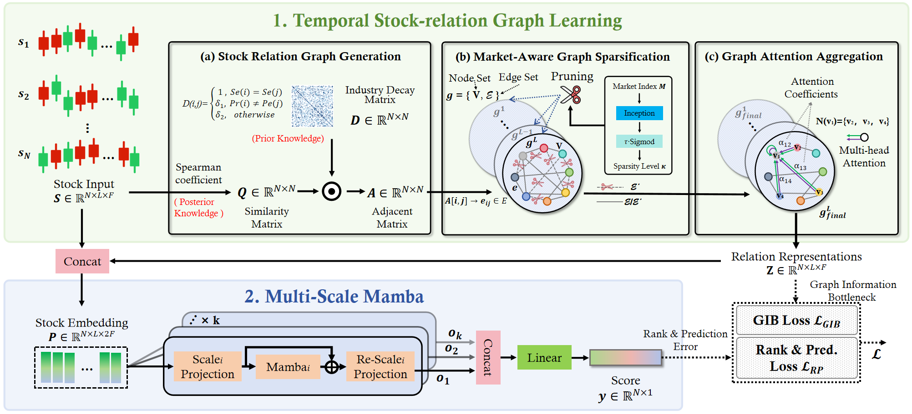

<p align="center">
    
</p>

# FinMamba: Market-Aware Graph Enhanced Multi-Level Mamba for Stock Movement Prediction

## 📰 News

🚩 2026-06-22: FinMamba has been accepted as KDD 2026 Workshop on Machine Learning in Finance Oral.

🚩 2025-02-10: Initial upload to arXiv [PDF](https://arxiv.org/abs/2502.06707).

## 🌟 Overview

FinMamba consists of  Temporal Stock-Correlation Graph learning and Multi-Scale Mamba for stock movement prediction.



## 🛠 Usage

The complete FinMamba workflow consists of three sequential stages:

```text
Generate daily relation graphs → Train FinMamba → Run the backtest
```

Please execute the steps below in this order. In particular, the daily short-term stock-relation graphs must be generated before training starts.

### Prerequisites

Install the required Python packages:

```bash
pip install -r requirements.txt
```

To run the backtest notebook, also make sure that Jupyter Notebook is available in the environment:

```bash
pip install notebook
```

For the NASDAQ 100 example, the expected input files are organized as follows:

```text
data/
├── nasdaqfea.pkl
├── nasdaqlab.pkl
└── nasdaq_industry_relationship.npy

stock/
└── NASDAQ100_new.csv
```

The feature data, label data, industry-relation matrix, and backtest market data must use a consistent stock universe and trading calendar.

### Step 1: Generate Daily Short-Term Stock-Relation Graphs

Before training, run `genRelation.py` to generate a short-term relation graph for every trading day. For each day, the script uses a rolling historical window ending on that day to estimate pairwise stock correlations and saves the resulting adjacency matrix as a pickle file.

For example, the following command generates 20-day Spearman relation graphs for the NASDAQ 100 universe:

```bash
python genRelation.py \
  --stock nasdaq \
  --data-dir data \
  --output-dir nasdaq_stock_relation \
  --lookback 20 \
  --method spearman \
  --device auto
```

The generated files are stored as:

```text
nasdaq_stock_relation/
├── day0.pkl
├── day1.pkl
├── day2.pkl
└── ...
```

One `day{index}.pkl` file is required for each trading day used by the training, validation, and test periods. The output directory must be the same as the relation directory configured for training. Use `--method pcc` instead of `--method spearman` to generate Pearson-correlation graphs.

### Step 2: Train and Evaluate FinMamba

After all daily relation graphs have been generated, train FinMamba with:

```bash
bash run_finmamba.sh
```

All model, optimization, data-split, device, and output parameters are defined in `run_finmamba.sh`. By default, the script reads the relation graphs from `nasdaq_stock_relation/` and produces:

```text
best_model.pth   # best checkpoint selected on the validation set
scores.csv       # raw prediction scores on the test set
pred.csv         # predictions aligned with stock identifiers and dates
```

Common paths and the device can be overridden without editing the script. For example:

```bash
DEVICE=cuda:1 \
RELATION_DIR=nasdaq_stock_relation \
OUTPUT_DIR=outputs/nasdaq \
bash run_finmamba.sh
```

### Step 3: Run the Backtest

After training is complete, use `backtest.ipynb` to evaluate the trading performance of the predictions in `pred.csv`.

By default, the notebook reads:

```text
pred.csv
stock/NASDAQ100_new.csv
```

Start Jupyter Notebook from the project root:

```bash
jupyter notebook backtest.ipynb
```

Then run the notebook cells in order to construct the prediction-based portfolio and calculate the backtest results. If `OUTPUT_DIR` was changed during training, update the `pred.csv` path in the notebook accordingly. For another stock universe, also update the market-data path and related date settings in the notebook.

## 📊 Dataset

### Form
The provided data is split into training, validation, and test sets, with 4 stock universes. (CSI 300, CSI 500, NASDAQ 100, S&P 500)

In our code, the data will be gathered chronically and then grouped by prediction dates. the data iterated by the data loader is of shape (T, N, F), where:

- T - length of lookback_window, T=20.
- N - number of stocks. 
- F - 5 for NASDAQ 100 and S&P 500 including high, low, open, close, volume. 6 for CSI 300 and CSI 500 including high, low, open, close, volume, turnover.

### Market Index
For convenience and fairness, we extract the market index as the mean value of the stocks included in the target set.

## 📚 Citation

If you find this repository helpful, please cite our paper:

```bibtex
@article{hu2025finmamba,
  title={Finmamba: Market-aware graph enhanced multi-level mamba for stock movement prediction},
  author={Hu, Yifan and Liu, Peiyuan and Li, Yuante and Cheng, Dawei and Li, Naiqi and Dai, Tao and Bao, Jigang and Xia, Shu-Tao},
  journal={arXiv preprint arXiv:2502.06707},
  year={2025}
}
```


